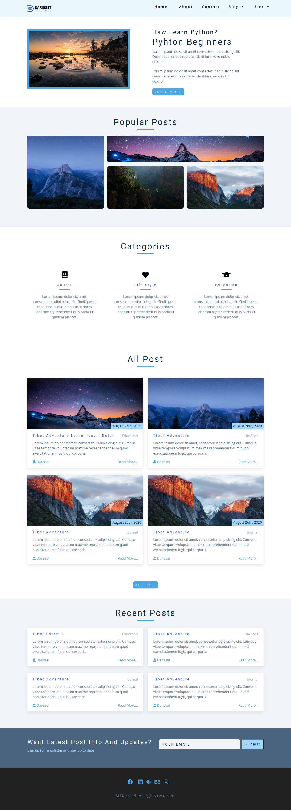
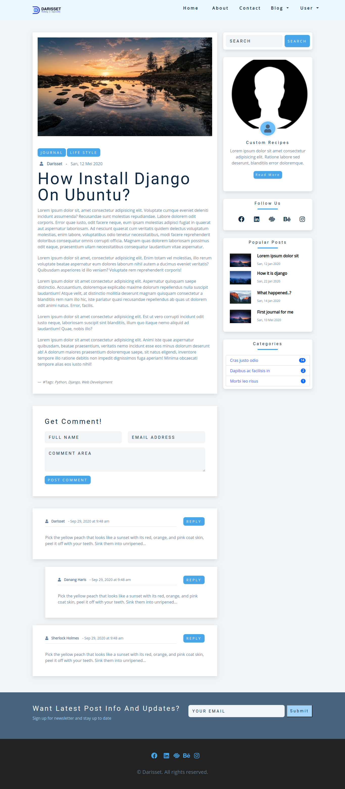

# Blog Template

I provide you with a ready-to-use set of code snippets and utilities. This blog template consists of 7 different page variations, such as: homepage, user, post details, and several other pages. A preview of this great blog template is available here: [Screenshots](screenshot/)

 

## Template Preview

<kbd><kbd/>

 
 

<kbd><kbd/>
     
 

### Follow me! just kidding :)

[][website]
[][twitter]
[][linkedin]
[][instagram]

 

[website]: https://darisset.site
[twitter]: https://twitter.com/Danangharisset1
[instagram]: https://www.instagram.com/mr.danang_haris
[linkedin]: https://www.linkedin.com/in/danang-haris-setiawan-darisset
[webdevplaylist]: https://github.com/danangharissetiawan/danangharissetiawan
